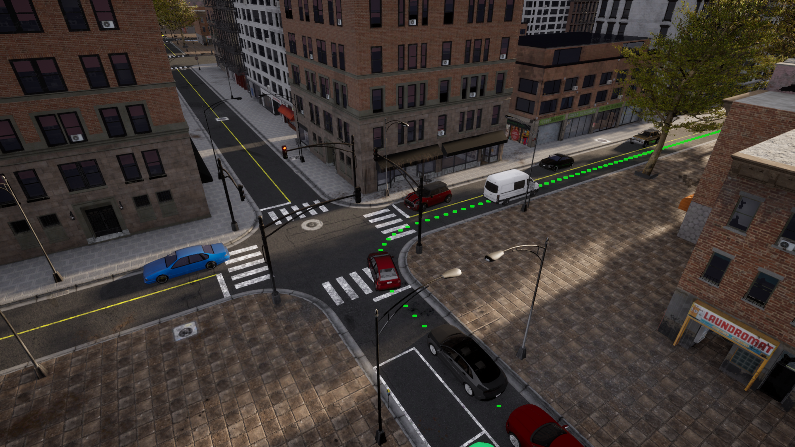

[上一页：比赛介绍](README.md)

---

## 2.1. 系统安装
### 获取比赛安装包
- 下载 [**`Carla比赛安装包`**](https://carla-releases.s3.eu-west-3.amazonaws.com/Linux/Leaderboard/CARLA_Leaderboard_20.tar.gz)。

> 此版本的 Carla 基于 0.9.13 做了修改，包含了一些 0.9.14 的新特性，最新 [CARLA 文档](https://carla.readthedocs.io/en/latest/) 的 API 可作为参考。

- 将安装包解压缩到一个文件夹中。
```bash
export WORK_DIR=~/workdir
mkdir -p ${WORK_DIR}
cd ${WORK_DIR}
tar -zcvf CARLA_Leaderboard_20.tar.gz carla
```
- 在以下命令行中，设置 **`${CARLA_ROOT}`** 变量为`Carla`根目录。
```bash
export CARLA_ROOT=${WORK_DIR}/carla
```
 
- 为了使用 Carla Python API，您需要安装一些依赖项, 例如对于conda：
```bash
conda create -n py37 python=3.7
conda activate py37
cd ${CARLA_ROOT}  # Change ${CARLA_ROOT} for your CARLA root folder
pip3 install -r PythonAPI/carla/requirements.txt
```

### 安装 leaderboard 和 Scenario_Runner
-下载大赛 [leaderboard](https://github.com/carla-simulator/scenario_runner.git) **leaderboard-2.0** 分支
```bash
cd ${WORK_DIR}
git clone -b leaderboard-2.0 --single-branch https://github.com/carla-simulator/leaderboard.git
```

!>  <span style="color: red; font-weight: 1000; font-size: 120%; text-underline-position: below; text-decoration: underline;">我们直接使用的 leaderboard-2.0，里面的readme会跳转到leaderboard官方英文网站，这块需要如何适配？</span>

- 设置 **`${LEADERBOARD_ROOT}`** 变量到你的比赛文件根目录
```bash
export LEADERBOARD_ROOT=${WORK_DIR}/leaderboard
```
- 安装所需的 Python 依赖项
```bash
cd ${LEADERBOARD_ROOT} # Change ${LEADERBOARD_ROOT} for your Leaderboard root folder
pip3 install -r requirements.txt
```
 
- 下载 [Scenario Runner](https://github.com/carla-simulator/scenario_runner.git) 仓库 **leaderboard-2.0** 分支
```bash
cd ${WORK_DIR}
git clone -b leaderboard-2.0 --single-branch https://github.com/carla-simulator/scenario_runner.git
```
 
- 改变 **`${SCENARIO_RUNNER_ROOT}`** 到对应的 Scenario_Runner 根目录
```bash
export SCENARIO_RUNNER_ROOT=${WORK_DIR}/scenario_runner 
```
 
- 使用相同的 Python 环境安装所需的 Python 依赖项
```bash
cd ${SCENARIO_RUNNER_ROOT} # Change ${SCENARIO_RUNNER_ROOT} for your Scenario_Runner root folder
pip3 install -r requirements.txt
```

### 定义环境变量
我们需要确保不同的模块能够相互找到对方。
 
●   用以下命令打开`~/.bashrc`配置文件
```bash
gedit ~/.bashrc
```

●   编辑你的`~/.bashrc`配置文件，添加下面的定义。编辑后保存并关闭该文件
```bash
export CARLA_ROOT=PATH_TO_CARLA_ROOT
export SCENARIO_RUNNER_ROOT=PATH_TO_SCENARIO_RUNNER
export LEADERBOARD_ROOT=PATH_TO_LEADERBOARD
export PYTHONPATH="${CARLA_ROOT}/PythonAPI/carla/":"${SCENARIO_RUNNER_ROOT}":"${LEADERBOARD_ROOT}":"${CARLA_ROOT}/PythonAPI/carla/dist/carla-0.9.13-py3.7-linux-x86_64.egg":${PYTHONPATH}

```
●   记得使用以下命令将`.bashrc`作为源码，使这些变化生效：
```bash
source ~/.bashrc
```
 
## 2.2. 创建Autonomous agents
比赛系统将负责运行你的autonomous agent，并评估其在不同交通情况下的行为，跨越多条路线。为了更好地理解这个过程，我们来运行一个基本的agent。
 
●   在一个终端上运行 CARLA 服务器
```bash
cd ${CARLA_ROOT}
./CarlaUE4.sh -quality-level=Epic -world-port=2000 -resx=800 -resy=600
```

●   在另一个终端，进入到 `${LEADERBOARD_ROOT}`

```bash
touch test_run.sh
chmod +x test_run.sh
```

●   将以下代码粘贴到 test_run.sh 中。这将为参数化设置一些环境变量，并运行 run_evaluation.sh，它将使用这些变量作为参数给 run_evaluator.py 脚本
```bash
export ROUTES=${LEADERBOARD_ROOT}/data/routes_devtest.xml
export REPETITIONS=1
export DEBUG_CHALLENGE=1
export TEAM_AGENT=${LEADERBOARD_ROOT}/leaderboard/autoagents/human_agent.py
export CHECKPOINT_ENDPOINT=${LEADERBOARD_ROOT}/results.json
export CHALLENGE_TRACK_CODENAME=SENSORS

./scripts/run_evaluation.sh
```

●   运行脚本
`./test_run.sh`
这将启动一个 pygame 窗口，让你选择手动控制一个 agent。 沿着彩色航点指示的路线前进，以到达你的目的地。 脚本将在地图 Town12 加载两条路线。




在运行测试时，我们设置或用到了一系列的参数，这些参数的作用如下：
 
- `ROUTES (XML)` — 将用于模拟的路线集。每条路线都有一个起点（第一个航点），和一个终点（最后一个航点）。此外，它们还可以包含一个天气概况，以设置特定的天气条件。一个XML包含许多路线，每一条都有一个ID。为了训练和验证，用户可以对路线进行的修改、添加和删除。Carsmos 提供了一套用于调试、训练和验证的路线。 用于在线评估的验证路线是保密的。 这个文件还包括将在模拟环境中测试的场景，每条路线都有自己的一套场景。一个场景被定义为一个交通场景。Agents 必须有效的处理这些交通场景，才能通过测试。参与者可以获得一套在公开的地图上适用的交通场景。 这些场景列表可以在 [**这里查看**](scenarios.md)。
 
- `REPETITIONS (int)` — 每条路线因统计目的而被重复的次数。

- `TEAM_AGENT` (Python 模块) — 连接 agent 的 Python 模块的路径。 创建 agent 的步骤将在下一章节详解。
 
其他相关参数的描述如下：
- `TEAM_CONFIG`（由用户定义）— 由提供的agent读取的任意配置文件的路径。你需要在你的agent类中定义和解析这个文件。
- `DEBUG_CHALLENGE (int)` — 表示在模拟过程中是否应该显示调试信息的标志。默认情况下，这个变量是未设置的（0），不会显示任何调试信息。当它被设置为1时，模拟器将显示要遵循的参考路线。如果这个变量被设置为大于1，引擎将打印出模拟的完整状态，用于调试。
- `CHECKPOINT_ENDPOINT (JSON)` — 将记录比赛指标的文件名。
- `RECORD_PATH (string)` — 存储CARLA日志的文件夹的路径。默认情况下不设置。
- `RESUME` — 表示是否应该从最后一条路线恢复模拟的标志。默认情况下不设置。
 
这些环境变量被传递给`${LEADERBOARD_ROOT}/leaderboard/leaderboard_evaluator.py`，它作为执行模拟的入口。可以参考`leaderboard_evaluator.py`，了解更多关于你的 agent 将如何被执行和评估的细节。
 
 
## 2.3. 创建你自己的 Autonomous Agent
定义一个新的 agent，首先要创建一个新的类，该类继承于`leaderboard.autoagents.autonomous_agent.AutonomousAgent`.

### 创建 get_entry_point
首先，定义一个名为 get_entry_point 的函数，返回你的新类的名称。这将被用来自动实例化你的 agent。
```python
from leaderboard.autoagents.autonomous_agent import AutonomousAgent

def get_entry_point():
    return 'MyAgent'

class MyAgent(AutonomousAgent):
    ...
```

### 覆盖 setup 方法
在您的 agent 类中重写 setup 方法。这个方法执行你的agent需要的所有初始化和定义。它将在每次路线初始化时被自动调用。 它可以接收一个指向配置文件的可选参数。 用户应该解析这个文件。
```python
from leaderboard.autoagents.autonomous_agent import Track
...
def setup(self, path_to_conf_file):
    self.track = Track.SENSORS # At a minimum, this method sets the Leaderboard modality. In this case, SENSORS
```
?> `self.track` 属性是枚举类型而非字符串类型. 其取值只能为 Track.SENSORS 或 Track.MAP.
### 覆盖 sensors 方法
您必须覆盖 sensors 方法，该方法定义了您的 agent 所需的所有传感器。
```python
def sensors(self):
    sensors = [
        {'type': 'sensor.camera.rgb', 'id': 'Center',
         'x': 0.7, 'y': 0.0, 'z': 1.60, 'roll': 0.0, 'pitch': 0.0, 'yaw': 0.0, 'width': 300, 'height': 200, 'fov': 100},
        {'type': 'sensor.lidar.ray_cast', 'id': 'LIDAR',
         'x': 0.7, 'y': -0.4, 'z': 1.60, 'roll': 0.0, 'pitch': 0.0, 'yaw': -45.0},
        {'type': 'sensor.other.radar', 'id': 'RADAR',
         'x': 0.7, 'y': -0.4, 'z': 1.60, 'roll': 0.0, 'pitch': 0.0, 'yaw': -45.0, 'fov': 30},
        {'type': 'sensor.other.gnss', 'id': 'GPS',
         'x': 0.7, 'y': -0.4, 'z': 1.60},
        {'type': 'sensor.other.imu', 'id': 'IMU',
         'x': 0.7, 'y': -0.4, 'z': 1.60, 'roll': 0.0, 'pitch': 0.0, 'yaw': -45.0},
        {'type': 'sensor.opendrive_map', 'id': 'OpenDRIVE', 'reading_frequency': 1},
        {'type': 'sensor.speedometer', 'id': 'Speed'},
    ]
    return sensors
```
 
?> 大多数的传感器属性都有固定的值。这些可以在`agent_wrapper.py`中查到。这样做是为了让所有参赛队伍都使用同样的传感器框架。
 
每个传感器都被表示为一个字典，包含以下属性：

- `type`：要添加的传感器的类型。

- `id`：将被赋予传感器的标签，以便以后访问。

- `其他属性`：这些属性与传感器有关，例如：外在因素和视野。

用户可以设置每个传感器的内在参数和外在参数（位置和方向），以相对于车辆的坐标为准。请注意，CARLA使用虚幻引擎的坐标系统，即：X-前，Y-右，Z-上。
 
允许使用的传感器有：

- [**sensor.camera.rgb**](https://carla.readthedocs.io/en/0.9.10/ref_sensors/#rgb-camera) - 捕捉图像的普通相机。
- [**sensor.lidar.ray_cast**](https://carla.readthedocs.io/en/0.9.10/ref_sensors/#lidar-sensor) - Velodyne 64 激光雷达。
- [**sensor.other.radar**](https://carla.readthedocs.io/en/0.9.10/ref_sensors/#radar-sensor) - 远程雷达（最远100米）。
- [**sensor.other.gnss**](https://carla.readthedocs.io/en/0.9.10/ref_sensors/#gnss-sensor) - 返回地理位置数据的GPS传感器。
- [**sensor.other.imu**](https://carla.readthedocs.io/en/0.9.10/ref_sensors/#imu-sensor) - 六轴惯性测量单元。
- `sensor.opendrive_map` - 伪传感器，以OpenDRIVE格式解析为字符串的高清地图。
- `sensor.speedometer` - 伪传感器，提供线性速度的近似值。

> 如果您尝试使用其他传感器或传感器参数名称错误，会使传感器设置失败。
 
您可以使用这些传感器中的任何一个来配置你的传感器栈。但是，为了保持适度的计算负荷，我们对可以添加到一个agent中的传感器数量进行了以下限制：
```bash
sensor.camera.rgb: 4
sensor.lidar.ray_cast: 1
sensor.other.radar: 2
sensor.other.gnss: 1
sensor.other.imu: 1
sensor.opendrive_map: 1
sensor.speedometer: 1
```
> 设置太多单位的传感器将会失败。
 
此外，还有一些空间限制，限制了传感器在车辆体积内的位置。如果一个传感器在任何轴线上与它的父体相距超过3米（例如：`[3.1,0.0,0.0]`），设置将失败。
 
 
### 运行时 agent 与比赛系统的通信
#### 覆盖 run_step 方法（基于非 ROS 的 agents）
这个方法将在每个时间步长被调用一次，产生一个新的动作，其形式为 `carla.VehicleControl` 对象。确保该函数返回控制对象，该对象将被用于更新你的 agent。
```python
def run_step(self, input_data, timestamp):
    control = self._do_something_smart(input_data, timestamp)
    return control
```
 
●   `input_data`: 一个包含所请求的传感器数据的字典。这些数据已经在sensor_interface.py进行了预处理，并将以numpy数组的形式给出。这个字典由传感器方法中定义的id来索引。
 
●   `Timestamp`：当前模拟瞬间的时间戳。
 
你也可以访问 ego agent 为到达目的地所应走的路线。使用 `self._global_plan` 成员来访问地理定位路线，使用`self._global_plan_world_coord`来访问其在世界位置的对应。
 
### 覆盖destroy方法
在每条路线结束时，destroy 方法将被调用，在你需要清理的情况下，你的 agent 可以重写这个方法。例如，你可以利用这个函数来清除网络中任何不需要的储存。
```python
def destroy(self):
    pass
```

## 2.4. 训练和测试你的算法
我们准备了一套预定义的路线，作为一个起点。你可以使用这些路线来训练和验证你的算法的性能。路线可以在{LEADERBOARD_ROOT}/data文件夹中找到。
 
- `routes_training.xml`。 有15条用作训练数据的路线。
- `routes_testing.xml`。 有10条用作验证数据的路线。

---

[上一页：比赛介绍](README.md)

[下一页：比赛规则](rules.md)