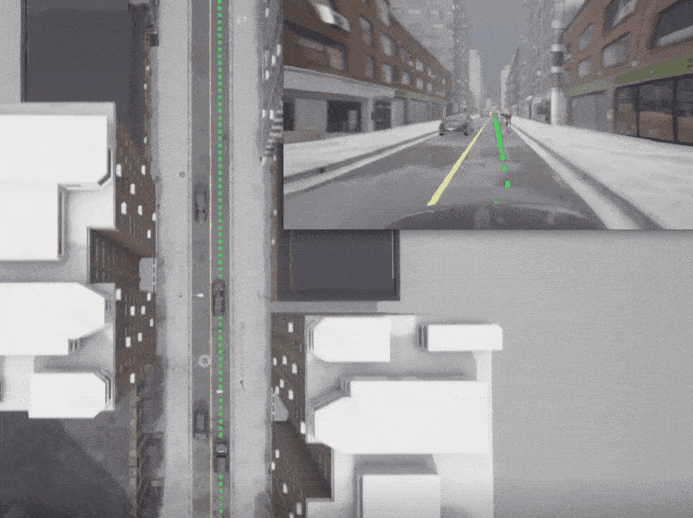

# 5. 比赛交通场景<!-- {docsify-ignore} -->
## 5.1. 失控

###  - 未事先采取行动的情况下失控

车辆由于道路状况不佳而失去控制，它必须恢复控制并回到原来的车道上。

## 5.2. 交通避让

###  - 在有来车的十字路口不受保护的左转弯

车辆在一个十字路口进行无保护的左转弯，向来车让行。

###  - 在有过路车辆的路口右转

车辆在一个十字路口进行右转，避让过往车辆。

 

###  - 在无信号灯的情况下通过十字路口

车辆需要与其他车辆协调，以通过一个无信号灯的十字路口。在这种情况下，假定第一个进入十字路口的车有优先权。

 

###  - 过路车辆在十字路口闯红灯

车辆在十字路口直行，但交叉路口的车辆闯红灯，迫使车辆避让以避免碰撞。

 

###  – 在十字路口遭遇迎面而来的自行车

车辆在十字路口转弯时，需要让对面的自行车先通过。

 

## 5.3. 高速公路

###  - 从匝道上并入高速公路

车辆从高速公路匝道并入有其他车辆行驶中的高速公路。

 

###  - 高速公路有其他车辆从匝道并入

车辆遇到另一辆从高速公路匝道上并入其车道的车辆。车辆必须减速、刹车或改变车道以避免碰撞。

###  - 静态切入

车辆遇到另一辆从静态交通的车道上切入其车道的车辆。车辆必须减速、刹车或改变车道以避免碰撞。

 

###  - 高速公路驶出

车辆必须穿过一条行驶中的车道，在一个匝道口离开高速公路。

 

###  - 向紧急车辆让路

一辆从后面驶来的紧急车辆接近了被测车辆，车辆必须避让，让紧急车辆通过。

 

## 5.4. 避开障碍物

###  – 车道上的障碍物

车辆遇到障碍物挡住了车道，必须进行变道以避开它。障碍物可能是一个建筑工地，一个事故现场或一辆停放的车辆。

 

###  – 车门障碍

车辆遇到一辆停在路边的车辆开门遮挡其车道，必须进行操作以避开它。

###  - 在车道边缘有缓慢移动的危险障碍物

车辆遇到了一个缓慢移动的危险障碍物，挡住了部分车道，必须刹车或操作以避开它。

 

###  – 其他车辆在弯道上侵入车道

车辆在弯道上遇到迎面而来的车辆因障碍物而侵入其车道，它必须刹车或操纵到路边以避开迎面而来的车辆。

 

## 5.5. 刹车和变道

###  – 前方车辆刹车后的纵向控制

前方车辆由于障碍物而突然减速，被测车辆必须进行紧急制动或避让动作。

 

###  - 无事先动作的障碍物规避

车辆在道路上遇到障碍物/突然出现的实体，必须进行紧急制动或避让动作。

 

###  - 行人从停放的车辆后面出现 

车辆遇到一个从停放的车辆后面出现并进入车道的行人，必须刹车或操纵以避开他。

 

###  - 有事先动作的障碍物规避

在车辆进行操作时，发现道路上有障碍物，必须进行紧急制动或避让动作。

 

###  – 停车车辆切入

车辆必须减速或刹车，以便让驶出侧方停车位的停车车辆切入前方。

 

###  - 改变车道以躲避缓慢行驶的前方车辆

车辆进行变道，以躲避行驶速度过慢的前方车辆。

###  - 与迎面而来的车辆一起通过障碍物

车辆必须在给对向车辆让路的前提下，使用对向车道绕过阻挡物。

 

## 5.6. 停车

###  – 停车驶出

车辆必须从侧方停车位驶出，进入交通流中。

